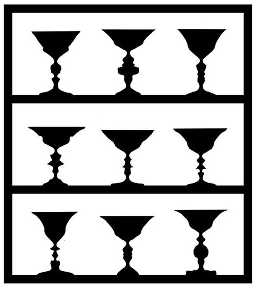

+++
date = "2023-08-16T14:50:00-04:00"
draft = false
title = "Faces vs Vases"
+++

When there is light on our planet, it comes from the sky, not from earth.  Our vision knows this perfectly  even though it was not until a few years ago that the psychologist Vilyanur Ramachandran, from the University of California, San Diego, came up with these splendid examples.  The actual effect of the direction of the light determining whether we see shapes as concave or convex was described by David Brewster in the 1800s.

We can thank the Danish psychologist Edgar Rubin for the figure above, or more correctly, the American photographer Zeke Berman’s elaboration of Rubin’s vase, a double image initially conceived by Rubin in 1915.  You can choose to see black vases-with the white faces as background.  Or you can see the faces-and then the black cases become background.  You can choose to see one as the shape, the other as the background.  But you cannot choose both of them simultaneously   You distinguish between signal and noise. Again it is not the raw data that you see; you see an interpretation  and only one interpretation at a time.  Berman’s version of the Rubin vases is not a drawing. He used silhouettes of real faces.  The figure above is a drawing inspired by Berman.

– Tor Nørretranders, The User Illusion
